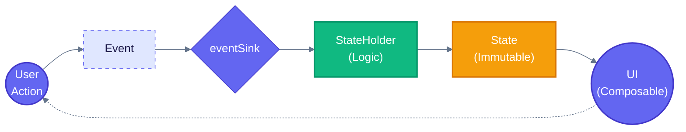
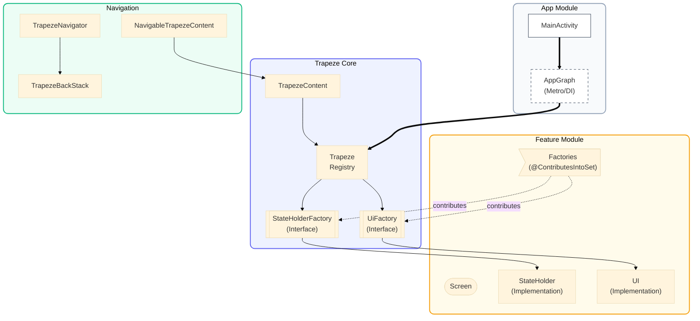

# MESA

A multi-library project providing type-safe, MESA-inspired architecture for Compose Multiplatform. The libraries enforce strict separation between logic (StateHolder), presentation (UI), and identity (Screen) with a Circuit-style factory pattern for decoupled component resolution.

## Supported Platforms

| Platform | Strata | Trapeze | Trapeze Navigation | Trapeze Test |
|----------|--------|---------|--------------------|--------------|
| Android | Yes | Yes | Yes | Yes |
| JVM (Desktop) | Yes | Yes | Yes | Yes |
| iOS | Yes | Yes | Yes | Yes |
| macOS | Yes | Yes | Yes | Yes |
| WASM | Yes | Yes | Yes | Yes |
| Linux (native) | Yes | - | - | - |
| Windows (native) | Yes | - | - | - |

> Compose-dependent modules (Trapeze, Trapeze Navigation, Trapeze Test) target platforms supported by JetBrains Compose Multiplatform. Desktop Linux/Windows are supported via the JVM target. Strata has no Compose dependency and additionally supports native Linux/Windows targets.

Platform-specific concerns like `Parcelable` are handled via `expect/actual` declarations following the [Circuit](https://github.com/slackhq/circuit) pattern: `TrapezeScreen` and `TrapezeNavigationResult` extend `Parcelable` on Android, and are plain interfaces on all other platforms.

---

## Libraries

| Library | Artifact | Purpose | Key Components |
|---------|----------|---------|----------------|
| **Trapeze** | `com.jkjamies:trapeze` | Core architecture | `TrapezeStateHolder`, `TrapezeState`, `TrapezeScreen`, `TrapezeEvent`, `TrapezeContent`, `Trapeze`, `TrapezeCompositionLocals`, `TrapezeMessage`, `TrapezeMessageManager`, `TrapezeNavigationResult` |
| **Trapeze Navigation** | `com.jkjamies:trapeze-navigation` | Navigation layer | `NavigableTrapezeContent`, `TrapezeBackStack`, `TrapezeNavigator`, `LocalTrapezeNavigator`, `LocalTrapezeBackStack`, `LocalTrapezeBackStackEntry`, `rememberNavigationResult`, `NavigationResultEffect` |
| **Strata** | `com.jkjamies:strata` | Business logic | `StrataInteractor`, `StrataSubjectInteractor`, `StrataResult`, `strataLaunch` |
| **Trapeze Test** | `com.jkjamies:trapeze-test` | Test utilities | `TrapezeStateHolder.test`, `FakeTrapezeNavigator`, `TestEventSink`, `TrapezeReceiveTurbine`, `NavigationEvent` |
| **MESA BOM** | `com.jkjamies:mesa-bom` | Bill of Materials | Aligns versions of all MESA libraries |

---

## Trapeze Architecture

Trapeze implements the **MESA pattern** (Modular, Explicit, State-driven, Architecture).

### The Five Components

| Component | Role | Requirements |
|-----------|------|--------------|
| **Screen** | Routing key / destination identifier (pure key, not passed into StateHolder) | Implements `TrapezeScreen` (`Parcelable` on Android, plain interface on other platforms) |
| **State** | Immutable display data + event sink | Implements `TrapezeState` |
| **Event** | User interactions | Implements `TrapezeEvent` |
| **StateHolder** | Logic layer producing State | Extends `TrapezeStateHolder<S, T, E>` |
| **UI** | Stateless Composable | `@Composable (Modifier, State) -> Unit` |

### Data Flow



### Architecture Overview




---


## Setup

### 1. Add Dependencies

**Using the BOM** (recommended):
```kotlin
dependencies {
    implementation(platform("com.jkjamies:mesa-bom:0.3.0"))
    implementation("com.jkjamies:trapeze")              // version from BOM
    implementation("com.jkjamies:trapeze-navigation")   // version from BOM
    implementation("com.jkjamies:strata")               // version from BOM
    testImplementation("com.jkjamies:trapeze-test")     // version from BOM
}
```

**From GitHub Packages** (external consumers):

Add the GitHub Packages repository to your `settings.gradle.kts` or root `build.gradle.kts`:
```kotlin
repositories {
    maven {
        url = uri("https://maven.pkg.github.com/jkjamies/MESA-Android")
        credentials {
            username = providers.gradleProperty("gpr.user").orNull
                ?: System.getenv("GITHUB_ACTOR")
            password = providers.gradleProperty("gpr.token").orNull
                ?: System.getenv("GITHUB_TOKEN")
        }
    }
}
```

> **Note**: GitHub Packages requires authentication even for public packages. Create a [personal access token](https://github.com/settings/tokens) with `read:packages` scope and set `gpr.user` / `gpr.token` in your `~/.gradle/gradle.properties`.

**For local/monorepo development**:
```kotlin
implementation(project(":trapeze"))
implementation(project(":trapeze-navigation"))
implementation(project(":strata"))
testImplementation(project(":trapeze-test"))
```

### 2. Configure DI Graph (Metro)
```kotlin
@DependencyGraph(AppScope::class)
interface AppGraph : MetroAppComponentProviders {
    @Multibinds val stateHolderFactories: Set<Trapeze.StateHolderFactory>
    @Multibinds val uiFactories: Set<Trapeze.UiFactory>

    val trapeze: Trapeze
        @Provides get() = Trapeze.Builder()
            .apply { stateHolderFactories.forEach { addStateHolderFactory(it) } }
            .apply { uiFactories.forEach { addUiFactory(it) } }
            .build()
}
```

### 3. Set Up Activity
```kotlin
class MainActivity : ComponentActivity() {
    @Inject lateinit var trapeze: Trapeze

    override fun onCreate(savedInstanceState: Bundle?) {
        super.onCreate(savedInstanceState)
        setContent {
            TrapezeCompositionLocals(trapeze) {
                val backStack = rememberSaveableBackStack(root = HomeScreen)
                val navigator = rememberTrapezeNavigator(backStack)

                NavigableTrapezeContent(navigator, backStack)
            }
        }
    }
}
```

---

## Creating a Feature

### Step 1: Define Screen, State, Event
```kotlin
// On Android, Screen extends Parcelable via expect/actual
@Parcelize
data class CounterScreen(val initialCount: Int) : TrapezeScreen, Parcelable

data class CounterState(
    val count: Int,
    val eventSink: (CounterEvent) -> Unit
) : TrapezeState

sealed interface CounterEvent : TrapezeEvent {
    data object Increment : CounterEvent
    data object Decrement : CounterEvent
}
```

### Step 2: Create StateHolder with Assisted Inject
The factory extracts screen args and passes them as plain constructor params. The screen type `T` preserves compile-time coupling, but the screen instance is never stored:
```kotlin
class CounterStateHolder @AssistedInject constructor(
    @Assisted private val initialCount: Int,            // Extracted from screen by factory
    @Assisted private val navigator: TrapezeNavigator   // Runtime dependency
) : TrapezeStateHolder<CounterScreen, CounterState, CounterEvent>() {

    @Composable
    override fun produceState(): CounterState {
        var count by rememberSaveable { mutableIntStateOf(initialCount) }

        return CounterState(
            count = count,
            eventSink = wrapEventSink { event ->
                when (event) {
                    CounterEvent.Increment -> count++
                    CounterEvent.Decrement -> count--
                }
            }
        )
    }

    @AssistedFactory
    fun interface Factory {
        fun create(initialCount: Int, navigator: TrapezeNavigator): CounterStateHolder
    }
}
```

### Step 3: Create UI
```kotlin
@Composable
fun CounterUi(modifier: Modifier = Modifier, state: CounterState) {
    Column(modifier = modifier) {
        Text("Count: ${state.count}")
        Row {
            Button(onClick = { state.eventSink(CounterEvent.Decrement) }) {
                Text("-")
            }
            Button(onClick = { state.eventSink(CounterEvent.Increment) }) {
                Text("+")
            }
        }
    }
}
```

### Step 4: Create Factories
```kotlin
@ContributesIntoSet(AppScope::class)
class CounterStateHolderFactory @Inject constructor(
    private val factory: CounterStateHolder.Factory
) : Trapeze.StateHolderFactory {
    override fun create(
        screen: TrapezeScreen,
        navigator: TrapezeNavigator?
    ): TrapezeStateHolder<*, *, *>? {
        return if (screen is CounterScreen && navigator != null) {
            factory.create(screen.initialCount, navigator)  // Extract screen args here
        } else null
    }
}

@ContributesIntoSet(AppScope::class)
class CounterUiFactory @Inject constructor() : Trapeze.UiFactory {
    override fun create(screen: TrapezeScreen): TrapezeUi<*>? {
        return if (screen is CounterScreen) ::CounterUi else null
    }
}
```

> **Return `::FooUi`, a reference to a `@Composable` function — not a composable lambda.**
> `TrapezeContent` casts the resolved UI back to its concrete type, and Kotlin emits a real
> `CHECKCAST` for the function type. A function reference satisfies it; a composable lambda
> compiles to `ComposableLambdaImpl` and does not, failing at render time with a
> `ClassCastException` about `Function4` that says nothing about the actual mistake.

That's it! The factories are automatically discovered via Metro's aggregation and registered with the `Trapeze` instance.

---

## Navigation

### TrapezeNavigator
Injectable interface for navigation actions:
```kotlin
interface TrapezeNavigator {
    fun navigate(screen: TrapezeScreen)
    fun pop()
    fun <R : TrapezeNavigationResult> popWithResult(key: String, result: R)
    fun popToRoot()
    fun popTo(screen: TrapezeScreen): Boolean
}
```

### Back Handling

`NavigableTrapezeContent` intercepts the platform back affordance while more than one screen is
on the stack and pops the backstack. At the root it stays out of the way, so the host Activity
finishes as usual. Opt out with `handleBack = false` if you want to drive back yourself.

On targets with no system back affordance this is a no-op and the host drives the backstack.

### Retained State and Scopes

Compose ships this. Use it directly — MESA does not wrap it.

`retain { }` (artifact `androidx.compose.runtime:runtime-retain`, Compose 1.10+) sits between
`remember` and `rememberSaveable`: it survives recomposition *and* Android configuration changes,
and is retired when the content permanently leaves the composition. No wiring is required.

```kotlin
@Composable
override fun produceState(): FooState {
    val player = retain { ExoPlayer.Builder(appContext).build() }   // survives rotation
    // ...
}
```

Rules worth repeating from the Compose docs: retained values live in memory and do **not** survive
process death (pair with `rememberSaveable` when you need both), and you must never retain a
`Context`, `View`, `Activity`, `Lifecycle`, or anything holding a reference to one.

To release resources when a retained object is retired, have it implement `RetainObserver` and
clean up in `onRetired()`.

MESA does add one thing on top: `rememberRetainedCoroutineScope()`, a `CoroutineScope` held by
`retain` and cancelled from `RetainObserver.onRetired()`. It is the default scope behind
`wrapEventSink`, so a save started from an event sink survives a rotation and is cancelled when
the screen is permanently gone. Pass an explicit scope to `wrapEventSink` to opt out.

The scope inherits the composition's dispatcher and drops only its `Job`, so work stays on the
same thread — and under the headless test runtime stays on the test scheduler.

### Screen Identity

Screens are values: navigating to `HomeScreen` twice gives you two *equal* screens. Each push
occupies a `TrapezeBackStackEntry` with its own generated id, so the two visits keep separate
saveable UI state and separate navigation results rather than silently sharing them. The id
survives configuration changes and process death.

`LocalTrapezeBackStackEntry` exposes the entry currently being rendered.

### Navigation Result Passing
Return data from Screen B to Screen A when popping:

```kotlin
// Define a result type (Parcelable on Android)
@Parcelize
data class EditResult(val name: String) : TrapezeNavigationResult

// Screen B: produce result on pop
EditEvent.Save -> navigator.popWithResult("edit_result", EditResult(name))

// Screen A: consume result
val editResult = rememberNavigationResult("edit_result")
LaunchedEffect(editResult) {
    editResult?.let { result -> (result as? EditResult)?.let { name = it.name } }
}
```

Or, to react to a result exactly once rather than read it as state:

```kotlin
NavigationResultEffect("edit_result") { result ->
    (result as? EditResult)?.let { name = it.name }
}
```

Each result is taken off the backstack exactly once. `rememberNavigationResult` then latches
the delivered value until the screen leaves the composition, so it is safe to read across
recompositions. Results survive configuration changes and process death on Android.

Calling `popWithResult` while already at the root drops the result — there is no screen left
to consume it, and retaining it would leak for the lifetime of the backstack.

### Navigation from StateHolder
```kotlin
class CounterStateHolder @AssistedInject constructor(
    @Assisted private val initialCount: Int,
    @Assisted private val navigator: TrapezeNavigator
) : TrapezeStateHolder<CounterScreen, CounterState, CounterEvent>() {

    @Composable
    override fun produceState(): CounterState {
        return CounterState(
            // ...
            eventSink = wrapEventSink { event ->
                when (event) {
                    CounterEvent.GoToDetails -> navigator.navigate(DetailsScreen(count))
                    CounterEvent.GoBack -> navigator.pop()
                }
            }
        )
    }
}
```

### Accessing Navigator in Composables
```kotlin
@Composable
fun SomeComposable() {
    val navigator = LocalTrapezeNavigator.current
    Button(onClick = { navigator.navigate(OtherScreen) }) {
        Text("Navigate")
    }
}
```

---

## Strata (Business Logic)

Strata standardizes async operations and error handling.

### Interactor Types

| Type | Use Case | Return |
|------|----------|--------|
| `StrataInteractor<P, R>` | One-shot async (API calls, DB writes) | `StrataResult<R>` |
| `StrataSubjectInteractor<P, T>` | Streams/flows (observe data) | `Flow<T>` via `.flow` |

### One-Shot Interactor
```kotlin
class SaveNote @Inject constructor(
    private val repository: NoteRepository
) : StrataInteractor<NoteParams, Unit>() {
    override suspend fun doWork(params: NoteParams) {
        repository.save(params.id, params.content)
    }
}
```

### Stream Interactor
```kotlin
class ObserveNote @Inject constructor(
    private val repository: NoteRepository
) : StrataSubjectInteractor<String, Note>() {
    override fun createObservable(params: String): Flow<Note> {
        return repository.observe(params)
    }
}
```

A subject interactor starts idle and emits nothing until `invoke(params)`; `stop()` tears the
subscription down. Equal parameters are conflated, so re-triggering from a recomposition will
not resubscribe. Emitted *values* are delivered as-is — override `distinctValues` to `true` to
filter consecutive duplicates.

`StrataInteractor.inProgress` turns on immediately for user-initiated work and holds purely
ambient work back by `ambientLoadingDelay` (default 5s), so short background refreshes never
flash a spinner. The delay is measured from the moment loading became ambient, so overlapping
background calls cannot keep deferring it. Both that and `defaultTimeout` are overridable per
interactor.

### Launch Utilities

`strataLaunch` runs on `Dispatchers.Default` by default (override via `context` parameter):
```kotlin
// Default dispatcher
strataLaunch {
    saveData(params).onFailure { error: StrataException -> /* handle */ }
}

// Override dispatcher
strataLaunch(Dispatchers.Main) { /* runs on main thread */ }
```

`strataLaunchWithResult` combines launch + automatic error wrapping, returning `Deferred<StrataResult<T>>`:
```kotlin
val deferred = strataLaunchWithResult { fetchData(params) }
val result = deferred.await()
```

### StrataResult Extensions

| Extension | Description |
|-----------|-------------|
| `onSuccess { }` | Side-effect on success, returns original result |
| `onFailure { }` | Side-effect on failure, returns original result |
| `getOrNull()` | Returns value or null on failure |
| `getOrDefault(default)` | Returns value or a provided default on failure |
| `getOrElse { error -> }` | Returns value or computes fallback from the error |
| `map { }` | Transforms success value, passes failure through |
| `flatMap { }` | Chains another `StrataResult`-returning step, passes failure through |
| `recover { error -> }` | Replaces a failure by running a fallback that returns a `StrataResult` |
| `fold(onSuccess, onFailure)` | Produces a single value for both outcomes |

### Usage in StateHolder
```kotlin
class NoteStateHolder @AssistedInject constructor(
    @Assisted private val noteId: String,               // Extracted from screen by factory
    @Assisted private val navigator: TrapezeNavigator,
    private val saveNote: Lazy<SaveNote>,
    private val observeNote: Lazy<ObserveNote>
) : TrapezeStateHolder<NoteScreen, NoteState, NoteEvent>() {

    @Composable
    override fun produceState(): NoteState {
        // Trigger stream observation
        LaunchedEffect(noteId) {
            observeNote.value(noteId)
        }
        val note by observeNote.value.flow.collectAsState(initial = null)

        return NoteState(
            note = note,
            eventSink = wrapEventSink { event ->
                when (event) {
                    is NoteEvent.Save -> strataLaunch {
                        val result = saveNote.value(event.params)
                        // map + getOrDefault: safely extract a value with fallback
                        val savedId = result.map { event.params.id }.getOrDefault("")
                        // fold: produce a message for both outcomes. The failure branch
                        // carries the exception as `cause` for logging rather than showing it.
                        val message = result.fold(
                            onSuccess = { TrapezeMessage("Saved $savedId successfully!") },
                            onFailure = { error ->
                                TrapezeMessage("Couldn't save your note.", cause = error)
                            }
                        )
                    }
                }
            }
        )
    }
}
```

---

## Dependency Injection (Metro)

### Key Annotations

| Annotation | Purpose |
|------------|---------|
| `@ContributesBinding(AppScope::class)` | Bind implementation to interface |
| `@ContributesIntoSet(AppScope::class)` | Add to multibinding set (factories) |
| `@AssistedInject` / `@AssistedFactory` | Runtime dependency injection |
| `@Inject` | Standard constructor injection |

### Assisted vs Regular Injection

| Dependency Type | Injection Style | Example |
|-----------------|-----------------|---------|
| **Runtime context** | `@Assisted` | `TrapezeNavigator`, `AppInterop` |
| **Graph singletons** | Regular `@Inject` | Use cases, repositories |

```kotlin
class FooStateHolder @AssistedInject constructor(
    @Assisted private val navigator: TrapezeNavigator,  // Runtime
    private val fooUseCase: Lazy<FooUseCase>            // Graph singleton
)
```

---

## Module Structure

### Clean Architecture Layout
```
features/foo/
  ├── api/           # Public interfaces (stable API)
  │   ├── FooModel.kt
  │   └── FooUseCase.kt
  ├── domain/        # Business logic (internal)
  │   ├── FooUseCaseImpl.kt
  │   └── FooRepository.kt
  ├── data/          # Repository implementations
  │   └── FooRepositoryImpl.kt
  └── presentation/  # UI + StateHolder + Factories
      ├── FooScreen.kt
      ├── FooStateHolder.kt
      ├── FooFactories.kt
      └── FooUi.kt
```

### Dependency Rules
- `presentation` → `api` (use case abstractions only; implementations are bound at the app graph)
- `data` → `domain`
- `domain` → `api`
- `api` → no internal dependencies

Declare a dependency with `api(...)` whenever its types appear in the module's own public
API — as a supertype, constructor parameter, or return type. `implementation(...)` keeps
them off the consumer's compile classpath.

---

## Best Practices

### UDF Flow
Always follow: UI → Event → eventSink → StateHolder → State → UI

### No ViewModels
Logic belongs in `TrapezeStateHolder`, not Android ViewModels.

### Stateless UI
Composables must never hold business logic or persistent state.

### State Persistence
Use `rememberSaveable` for state that survives configuration changes:
```kotlin
var count by rememberSaveable { mutableIntStateOf(0) }
```

### Event Safety
Wrap event sink using `wrapEventSink` helper:
```kotlin
val wrappedSink = wrapEventSink(eventSink)
```

### Transient UI Messages
Use `TrapezeMessage` and `TrapezeMessageManager` to handle one-off events (snackbars, toasts) complying with UDF.

**StateHolder:**
```kotlin
val messageManager = remember { TrapezeMessageManager() }
val message by messageManager.message.collectAsState(initial = null)

// `message` is copy written for the user. Attach the failure as `cause` — it is carried for
// logging and crash reporting, and is never rendered by Trapeze.
messageManager.emitMessage(
    TrapezeMessage("Couldn't save your changes.", cause = error)
)

// Dismiss one message by id — this is what the UI's dismiss action calls back into.
messageManager.clearMessage(msg.id)

// Clear all messages
messageManager.clearAll()
```

> **Do not derive the displayed text from `throwable.message`.** Exception text routinely
> carries request URLs, query fragments, and file paths. `TrapezeMessage` deliberately offers
> no throwable-only factory.

**UI:**
```kotlin
state.trapezeMessage?.let { msg ->
    Snackbar(
        action = { Button(onClick = { state.eventSink(ClearError(msg.id)) }) { Text("Dismiss") } }
    ) { Text(msg.message) }
}
```

**Note**: `ExperimentalUuidApi` is globally opted-in via the root build configuration.

---

## License

```
Copyright 2026 Jason Jamieson

Licensed under the Apache License, Version 2.0 (the "License");
you may not use this file except in compliance with the License.
You may obtain a copy of the License at

    http://www.apache.org/licenses/LICENSE-2.0
```
